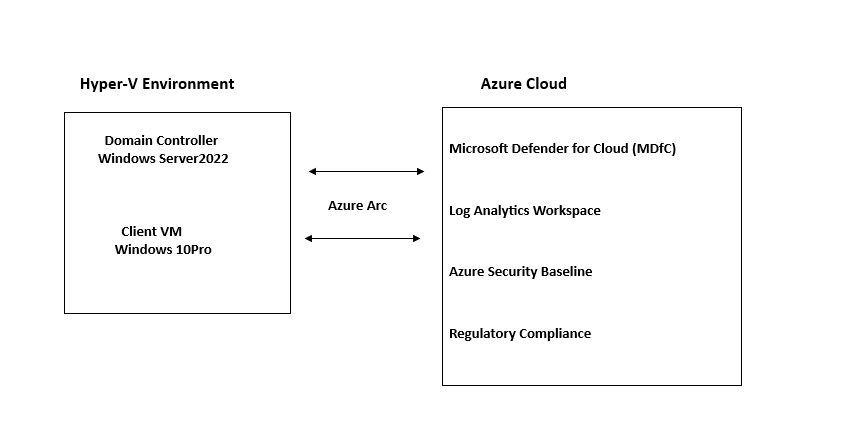

# 🔐 Azure Hybrid Security Baseline

## Overview
A complete security baseline implementation for a 
hybrid environment consisting of:
- Windows Server 2022 Domain Controller (On-premises/Hyper-V)
- Azure Arc enabled servers
- Microsoft Defender for Cloud
- Log Analytics Workspace
- Azure Policy compliance framework

## 🏗️ Architecture

## 📋 Prerequisites
- Azure Subscription (Free Trial supported)
- Windows Server 2022 Domain Controller
- Azure Arc agent installed and connected
- PowerShell 7.x or later
- Az PowerShell module installed

## 🛠️ Components Implemented

### 1. Azure Arc Configuration
- Arc agent health verification
- Resource tagging for governance

### 2. Microsoft Defender for Cloud
- Defender for Servers enabled
- Security contacts configured
- Enhanced security features activated

### 3. Log Analytics Workspace
- Centralized security logging
- 90-day retention configured
- Arc servers connected for monitoring

### 4. Security Policies
- Azure Security Benchmark v3 assigned
- Windows Server 2022 baseline applied
- Custom hybrid DC policy created

### 5. Compliance Reporting
- Automated HTML compliance reports
- Critical/Medium/Low finding categorization
- Remediation recommendations include

## Results
- Overall compliance score visible in screenshots
  
## Screenshots
See/screenshots folder for:
- Arc agent connected status
- Defender for cloud dashboard
- Log Analytics workspace
- Policy Assignment
- Compliance Report

## Technologies Used
- Microsoft Azure
- Azure Arc
- Microsoft Defender for Cloud
- Log Analytics/ Azure Monitor
- Azure Policy
- PowerShell
- Windows Server 2022

## Author
### Uzma Shabbir
### Azure Security Engineer | AZ-104 | AZ-500
### Available for Upwork for Azure Security

